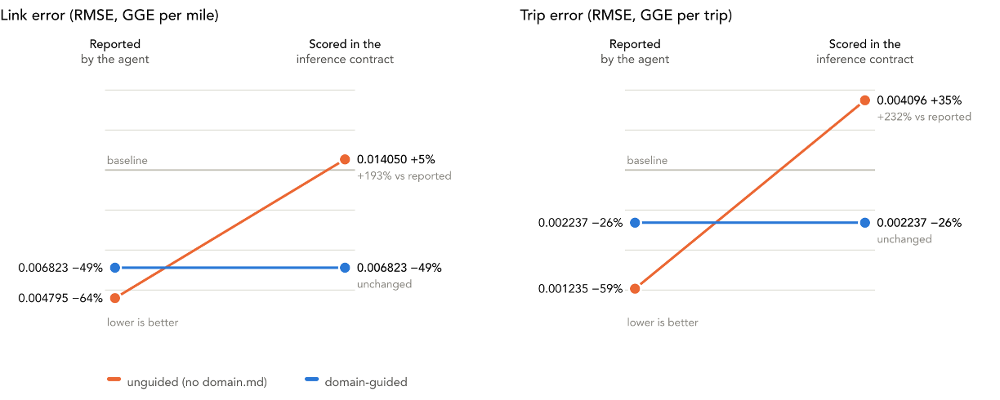
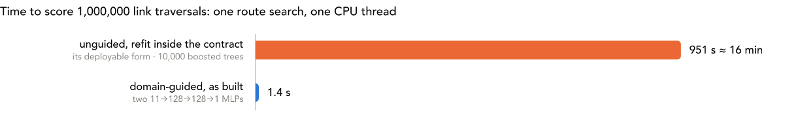
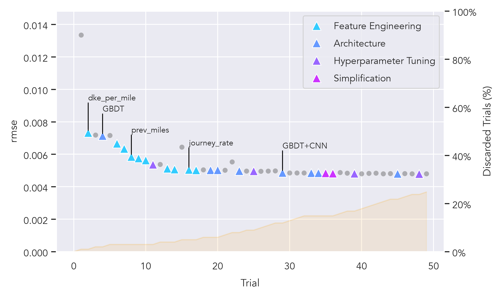
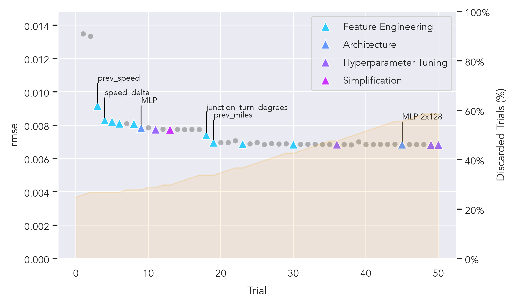

# teta-autoresearch-powertrain

## What is this?

This repository is an experiment archive for a study investigating the question: "How important is domain specification for an AI-assisted model training task?". It was prepared as part of an invited presentation at [US-RSE 2026](https://us-rse.org/usrse26/) titled _"Steering an LLM AutoResearch Loop with Domain Context: A Case Study with Vehicle Energy Models"_ by Nicholas Reinicke and Robert Fitzgerald.

Autonomous agents given open-ended modeling objectives on fixed datasets naturally find the most direct path to minimize loss. On tabular and sequential transportation datasets, that path often includes deleting difficult rows, exploiting artifacts of simulation traces, or reading forward into links that a routing engine has not yet traversed. The central question of this study is not simply "which agent reports a lower loss," but rather:

> **Can the agent infer the real-world constraints for a problem or does its reported improvements diverge from real improvements?**

To answer this, each final model is evaluated twice:
- **Reported**: What the agent's internal harness recorded on its selected features and processed dataset.
- **Audited**: The same model re-evaluated outside the experiment tree on a shared held-out set with strict deployment-time feature validity and operational constraints enforced.

The archive contains the complete version-controlled histories of both experimental sessions (see [unguided/PROVENANCE.md](unguided/PROVENANCE.md) and [domain-guided/PROVENANCE.md](domain-guided/PROVENANCE.md)), alongside an independent evaluation harness in [audit/README.md](audit/README.md).

---

## Experimental Setup & Session Descriptions

Both sessions were initialized identically using the [`teta-autoresearch`](https://github.com/NatLabRockies/teta-autoresearch) harness from the same template commit, evaluated against the same powertrain dataset, using the same protocol, metrics, and compute budget:

- **Baseline**: An identical starting baseline using our [existing Chevy Bolt 2017 Random Forest model](https://huggingface.co/NatLabRockies/routee-powertrain-model-library/blob/main/v2/chevrolet/bolt_bev/2017/rf_base_67ae9982/v1/metadata.json) for both sessions (link RMSE: 0.013345, trip RMSE: 0.003037).
- **Diff**: The initial repositories differed by **exactly one file**: [domain-guided/domain.md](domain-guided/domain.md) was present in the guided session and absent in the unguided arm (`git diff --stat 60e18ff 409009f`, 1 file changed, 46 insertions).
- **No web**: Neither session made any web searches or external web fetches during the runs. 
- **Prompts**: Both sessions were run independently with single-prompt initiation. The `domain-guided` session received a standard prompt plus "Go ahead". The `unguided` session received an identical kickoff with an explicit restatement that the domain file was absent and an instruction not to reference external paths. Both prompts are archived verbatim in each session's transcript audit.
- **Domain Specification**: [domain-guided/domain.md](domain-guided/domain.md) specifies the RouteE Compass shortest-path routing environment:
  - Allowed inputs: static link attributes (distance, grade, geometry) and link-average speed.
  - Link sequencing: at most **one** link of lookback; strictly no forward lookahead; no journey-position indexing or metrics.
  - Competing objectives: inference latency and memory overhead are primary constraints because predictions execute millions of times per route query.
- **Execution Isolation**: To prevent cross-session leakage, each session was run in a separate directory outside this repository and was merged into this archive only after completion. The Claude cache in `~/.claude` was wiped between sessions. Sessions were not run concurrently.

---

## Metric Observations

Evaluating both sessions under the RouteE Compass deployment contract ([audit/contract.py](audit/contract.py)) demonstrates how reported scores diverge from deployable reality:

| session | domain rules | exps | reported rmse | audited rmse | reported trip_rmse | audited trip_rmse | deployable features |
| --- | --- | --- | --- | --- | --- | --- | --- |
| unguided | absent | 50 | 0.004795 | **0.014050** | 0.001235 | **0.004096** | 5 of 13 |
| domain-guided | present | 51 | 0.006823 | **0.006823** | 0.002237 | **0.002237** | 11 of 11 |

*Baseline: 0.013345 link RMSE / 0.003037 trip RMSE. Audited metrics score models on held-out data (327,647 links) under deployment rules.*

### Key Metric Takeaways

##### Reported vs. Audited Reality Gap




- **Guided Stability**: For the `domain-guided` session, reported and audited numbers are identical (0.006823 link RMSE / 0.002237 trip RMSE). Because all 11 features conform to deployment constraints, no performance is lost when moving to production.
- **Unguided Collapse**: For `unguided`, reported performance (0.004795 / 0.001235) collapses under the contract to **0.014050 / 0.004096** (+193% link RMSE and +232% trip RMSE). Once non-deployable signals are removed, the model performs worse than the baseline it started from.
- **Audit Result**: When the unguided model family is retrained strictly on deployable features, it achieves 0.007557 / 0.002362. The domain-guided model outperforms this fair refit by +10.8% on link RMSE and +5.6% on trip RMSE. For more details, read more about [the audit](audit/README.md).

##### RMSE by trial

Unguided:



Guided:



*Progression of link RMSE and trip RMSE across experiment iterations (1–51) for unguided vs. domain-guided sessions, annotating key architectural shifts and where out-of-contract features were adopted.*

Improvement categories:

Category | Meaning | Examples
--- | --- | ---
Feature Engineering | Changes to the input features of the ML model | previous speed, edge sinuosity, overall trip energy
Architecture | Change of the ML model type | XGboost, CNN, MLP, GBDT
Hyperparameter Tuning | Parameters of the ML model | learning rate, number of hidden layers
Simplification | reduction of model simplicity without loss of performance | reduce nodes from 256 to 128, remove redundant "speed_delta" feature

---

## Behavioral Observations

The experiment transcripts and commit histories reveal contrasting behavioral patterns between the two agents:

### The Unguided Agent: Exploiting Leakage & Scale
1. **Time Travel**: In experiment 2, the agent added `dke_per_mile` spanning future link speeds, followed by explicit future link lengths (`next_miles`) and exit acceleration terms (`dv_out`). The agent created `journey_rate`, `journey_gge_per_mile`, and post-hoc journey residual offsets, despite having zero inference-time availability. It introduced a 2-block dilated 1-D CNN over the journey link sequence. With a receptive field of $\pm$ 6 links, the model structurally read 6 links into the future.
2. **Data Artifacts**: It discovered `gap_seconds` and `next_gap_seconds` (idle timestamps between link transitions). While correlated with stops, these columns are synthetic artifacts of drive-cycle simulations and do not exist on a static road network.
3. **Compute**: Lacking an inference budget constraint, it stacked an ensemble of 10,000 gradient-boosted trees alongside the CNN.

### The Domain-Guided Agent: Constrained Feature Engineering & Efficiency
1. **Physics**: Guided by [domain.md](domain-guided/domain.md), the agent developed valid single-link lookbacks (`prev_speed_mph`, `ke_delta_per_mile`), static road geometry features (`sinuosity`, `vertices_per_mile`), and turn headings (`junction_turn_degrees`).
2. **Lightweight Model Architecture**: It replaced tree ensembles with a pair of compact MLPs ($11 \to 128 \to 128 \to 1$). Recognizing inference latency as a competing objective, the agent spent its final 15+ experiments preserving its accuracy while halving operations to 35,840 multiply-accumulates (MACs) per link.

---

## Outcomes

### 1. Specification Prevents Phantom Progress
**Without explicit domain boundaries, autonomous agents optimize whatever metric they are given by exploiting informational shortcuts.** In this study, 8 of the unguided session's 13 features, its journey offset, and its CNN architecture were undeployable, turning a 64% reported error reduction into a net degradation in real deployment.

### 2. Domain Guidance Produces Better Real-World Accuracy
Comparing deployable models directly, the domain-guided model defeated the retrained unguided architecture on both link RMSE (0.006823 vs. 0.007557) and trip RMSE (0.002237 vs. 0.002362).

### 3. Inference Cost is the Dominant Practical Driver
In RouteE Compass, shortest-path searches evaluate link energy millions of times:
- `domain-guided`: **1.45 $\mu$s per link** (1.4 s for 1M traversals; 0.2 MB serialized model).
- `unguided/retrained-contract`: **950.7 $\mu$s per link** (951 s for 1M traversals; 35.5 MB model).  
The domain-guided model is **657× faster**, making graph search viable.

---

## Archive Layout

```
data/                 dataset notes — the data itself lives outside any git repo
unguided/             imported tree, full history; see [unguided/PROVENANCE.md](unguided/PROVENANCE.md)
domain-guided/        imported tree, full history; see [domain-guided/PROVENANCE.md](domain-guided/PROVENANCE.md)
audit/                independent scoring of both sessions' final models; see [audit/README.md](audit/README.md)
```

Each session carries its own provenance record ([unguided/PROVENANCE.md](unguided/PROVENANCE.md) and [domain-guided/PROVENANCE.md](domain-guided/PROVENANCE.md)) detailing scaffold commits, prompts, dataset checksums, and isolation boundaries. Full audit definitions and reproduction steps are documented in [audit/README.md](audit/README.md) and [audit/results/report.md](audit/results/report.md).

## Reading the Results

Address an session's commit history through its import tag:

```bash
git log --oneline import/unguided-bev-aug25                    # all 107 commits of that session
git log --grep='^exp' --oneline import/domain-guided-bev-aug26 # just the experiments
git show <commit>                                              # view specific experiment change
```

Experiment logs and metrics inside each session:
- Metric records: [unguided/results/results-bev-aug25.tsv](unguided/results/results-bev-aug25.tsv) and [domain-guided/results/results-bev-aug26.tsv](domain-guided/results/results-bev-aug26.tsv)
- Hypotheses & observations: [unguided/results/experiments-bev-aug25.jsonl](unguided/results/experiments-bev-aug25.jsonl)
- Operator transcripts: [unguided/results/transcript-audit-bev-aug25.md](unguided/results/transcript-audit-bev-aug25.md)
- Agent conclusions: [unguided/learnings.md](unguided/learnings.md) and [domain-guided/learnings.md](domain-guided/learnings.md)

## Running Further Sessions

Sessions must run inside their isolated run directories, never inside this archive:

```bash
~/repos/teta-autoresearch/tools/verify_isolation.sh ~/routee-autoresearch-runs/unguided

cd ~/routee-autoresearch-runs/unguided
claude
# Kickoff prompt: "Have a look at program.md and let's kick off a new experiment session"
```

To merge external session trees into this archive once completed:

```bash
git fetch unguided-src main
git merge -X subtree=unguided unguided-src/main
git tag -a import/unguided-<tag> unguided-src/main -m "..."
```

## Acknowledgments

This software is built on the "autoresearch" software by github user karpathy available [here](https://github.com/karpathy/autoresearch) and distributed under the MIT license.

## Citation

Reinicke, Nicholas and Fitzgerald, Robert. _"Steering an LLM AutoResearch Loop with Domain Context: A Case Study with Vehicle Energy Models"_. US-RSE 2026, San Jose, CA, USA.

## Metadata

NLR Software Record # SWR 26-090.
